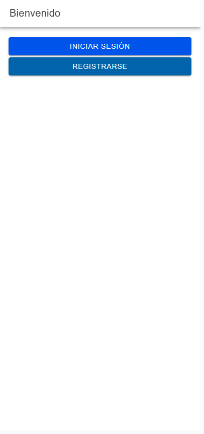
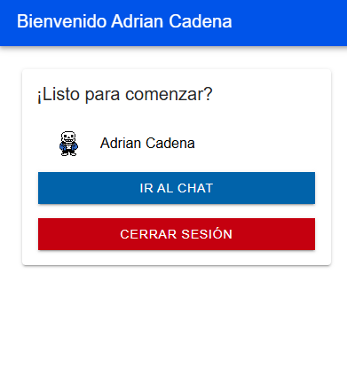
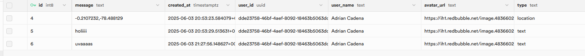
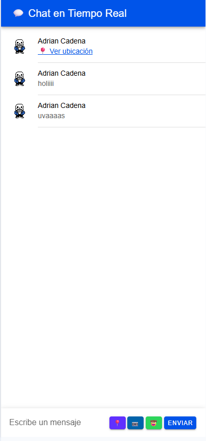

## Capturas de Pantalla

A continuación se muestran capturas de pantalla que presentan las partes clave de la aplicación:

### Página Principal / Registro  
Esta imagen muestra la página inicial donde los usuarios pueden registrarse para crear una nueva cuenta o navegar a la pantalla de inicio de sesión.

### Página de Inicio de Sesión  
Esta captura muestra la página dedicada para que los usuarios existentes puedan acceder a sus cuentas.

### Pantalla Principal  
Después de un inicio de sesión exitoso, los usuarios son dirigidos a esta pantalla principal, que funciona como el centro principal de la aplicación.

### Estructura de la Base de Datos  
Esta imagen ilustra el esquema de la base de datos, proporcionando una visión de cómo se organiza y almacena la información dentro de la aplicación.

### Interfaz de Chat  
Esta captura presenta la interfaz del chat en tiempo real, mostrando la funcionalidad de mensajería de la aplicación.

